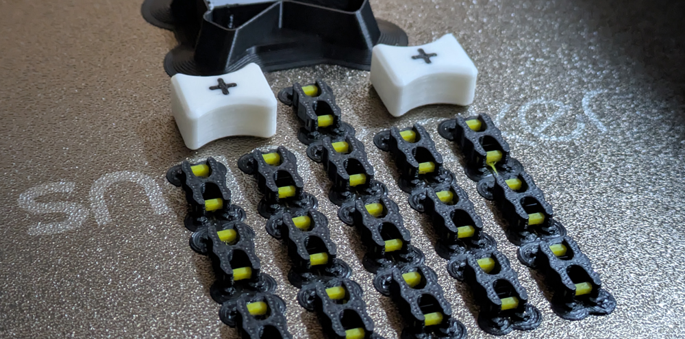
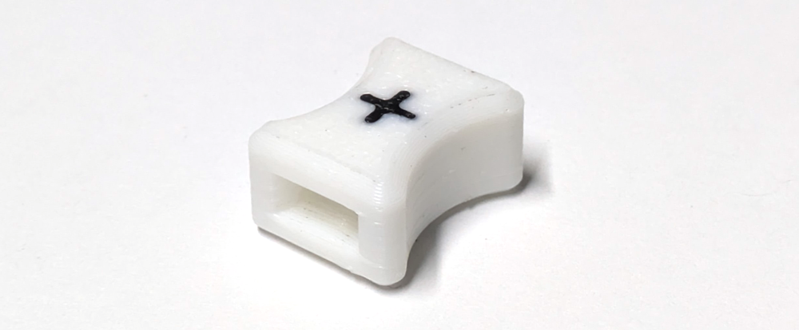

# SnapMates
An open source snap-fit solution for FDM printers 
<dl align="left" style="max-width: 640; inline-block;">
     
<dd>Incorporate them directly into your models as an alternative to glue or screws</dd>
</dl>

## Contents
* [What is a snap-fit connection?](#what-is-a-snap-fit-connection)
* [SnapMates are different](#snapmates-are-different)
* [How to use SnapMates](#how-to-use-snapmates)
* [Print Files](#print-files)
* [Sample Project](#sample-project)
* [How to create the sockets](#how-to-create-the-sockets)
* [Improvements](#improvements)

## What is a snap-fit connection?
Snap-fit is a standard term for design elements used on injection molded parts to provide free built-in fasteners. There are many examples in everyday life: zip ties, Tupperware lids, ziplock bags, backpack buckles, panels on the Snapmaker U1. There are a lot of variables. It’s easy to design one that doesn’t work well. Effective snap-fit solutions are generally:
1. resistant to breakage or permanent deformation when stressed
2. easy to install
3. reusable

FDM printed parts tend to have trouble with #1 on that list. Minimum feature size, internal stresses, and rough surface finish means flexing parts will break down a lot faster than injection molded nylon parts.  Switching to a flexible material fixes the issue with breaking, but then it’s not rigid enough to hold things together tightly, resulting in a mushy, and low quality connection. 

## SnapMates are different

### Materials
SnapMates have a multi-material design that overcomes the limitations of traditional FDM printing.  Stiffness from a PLA frame creates a tight and precise fit.  PEBA inserts control flexibility and allow for repeated use.  They can be left in place as semi-permanent connectors or removed and reused.  SnapMates are a direct result of two recent developments in 3D printing:
1. reliable/fast/inexpensive multi-material printing (I used the [SnapMaker U1](https://us.snapmaker.com/products/snapmaker-u1-3d-printer))
2. access to industrial grade flexible filaments like PEBA  

### Shape of Connector + Socket

The unique geometry shared by the connector and socket creates a semi-permanent, flush and repeatable fit between 3D printed parts.  When inserted, the connector flexes, conforming to the shape of the socket.  As the tips of the PLA frame squeeze together, they hit a small section of PEBA.  This flexible material acts like a backstop and prevents the PLA from bending too far and failing during use. It also traps the connector inside the socket, ensuring the fit is tight and secure.      

## How to use SnapMates

1.   **Load a SnapMate connector into the installer** (marked w/ a "+") 

3.   **Grip the installer firmly and press the connector straight into the part's socket.**  Press until the installer is flush with your part, then pull away to release it 

4.  **Hold parts level and press them together until the connector snaps in place.**  There should be little to no gap between parts 

5.  **To separate parts, just pull them apart** 

7.  **To remove a SnapMate connector from a part, use pliers** and grip the large flat sections of the connector, then pull straight out while gently pivoting left and right 

## Print files

If you have access to a SnapMaker U1, [download the 3MF](3MF/) to print a batch of connectors and installers with tested filament and print settings. 

 *** Designed for multi-material printers, the SnapMate connector may be printed on traditional FDM printers using a single rigid filament (like PLA), omitting the flexible backstops. *** 
     *** The mechanism will work for a time, but failure will be faster and more drastic. ***

### Connector

**The connector can be printed independently by downloading and importing the 3 STEP files named 'connector' into your multi-material capable slicer** (I use [SnapMaker Orca](https://www.snapmaker.com/snapmaker-orca)).  Select 'yes' when prompted to load files as a single object with multiple parts.  Assign PEBA to the flex locators and PLA to the frame.  
- The PEBA parts are designed with overhangs requiring PLA supports.  Never let PEBA print directly on the build plate.  It can stick forever.
- Enable PLA supports (second reminder)
- PEBA prints better at higher temps (~250C) and does not naturally bond with PLA.  Once the first purge layer of PEBA lays down flat, the rest is easy.  I had success by eliminating the part cooling fan and reducing print speed for the first few layers of PEBA - a slower, hotter print has more opportunity to mechanical bond with the imperfections in the PLA.      

### Installer

The connector's shape and size make it difficult (and painful) to repeatedly insert into fresh parts.  The installer is has a socket with a looser tolerance than a standard SnapMate socket and provides a way to grip and maneuver a connector for easier installation.  In your slicer of choice, import the 3 STLs named 'INSTALLER' as an object with multiple parts, print unsuppported in PLA.  Ignore the files named 'DETAILS' for a single color version.

## Sample project
(tba)

## How to create the sockets
**The STEP files named "SUBTRACT A" and "SUBTRACT B" are positive shapes that must be imported into CAD software, then subtracted from existing parts to create the sockets.** 

 *** Do not use the installer as a template for the sockets.  It is intentionally loose. ***

There are 2 subtract shapes (rather than 1) because splitting the original shape into two halves creates a shared face of equal size and shape. Use this shared face to locate the subtract shapes on your models.  The primary axis of the shared face should align with a shared face on the the models. These instructions assume 2 parts (A & B) also share a flush face - no gap or tolerance between them. 

### Step-by-step
1.  Import Subtract STEP files
2.  Place mate-connector 1 at the center of the face shared by the two subtract shapes
3.  Place mate-connector 2 on the face shared by part A & B where socket is desired (The parts are flush, so it can be either A or B.  Check that both parts have at least 7.5mm of depth. This allows for a minimum 1.2mm rear socket wall)
4.  Transform (move) the two subtract shapes from mate-connector 1 to mate-connector 2
5.  Boolean subtract the subtract shapes from parts A and B
6.  ~~Add a 1mm fillet to the 2 edges of each socket that first contact the connector (this makes it easier to insert and doesn't change the fit)~~ (the subtract shapes' geometry has been updated to include the fillet)

## Improvements
(tba)
